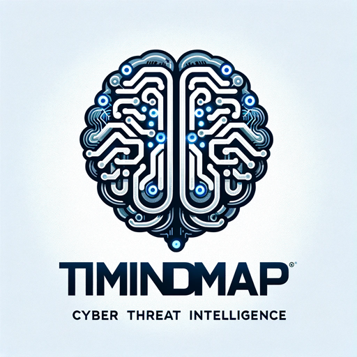

codes

Welcome to TI MINDMAP GPT, an AI-powered tool designed to help producing Threat Intelligence Mindmap.

**TI Mindmap** a tool developed using Large Language Models (LLMs), OpenAI GPT4. It's designed to assist cyber threat intelligence teams in quickly synthesizing and visualizing key information from various Threat Intelligence sources. 
The app operates on a 'Bring Your Own (OpenAI) Key' model, allowing users to leverage their own OpenAI keys for personalized and efficient information processing. 
This tool aims to streamline the data analysis process, enabling teams to focus more on strategic decision-making and less on the cumbersome task of data mining.

## Table of Contents
- [Project](#project)
- [Features](#features)
- [Know issues](#Knowissues)
- [Changelog](#changelog)
- [Contributing](#contributing)
- [License](#license)

## Project

If you find TI MINDMAP useful, please consider starring the repository on GitHub. 

## Features
- Summary and Mindmap
- Tweet Mindmap
- IOCs extraction
- Extract adversary tactics, techniques, and procedures
- Tactics, techniques and procedures by execution time
- Tactics, techniques and procedures timeline
- AI Chat on your TI Article
- Mermaid live editor integration
- PDF Report: Your Intelligence, Concisely Captured

## Know issues

### Version 0.1

Initial release of the application.

## Contributing

The project is open to external contributions. Pull requests are welcome.

## License

[GNU GPLv3](https://choosealicense.com/licenses/gpl-3.0/)